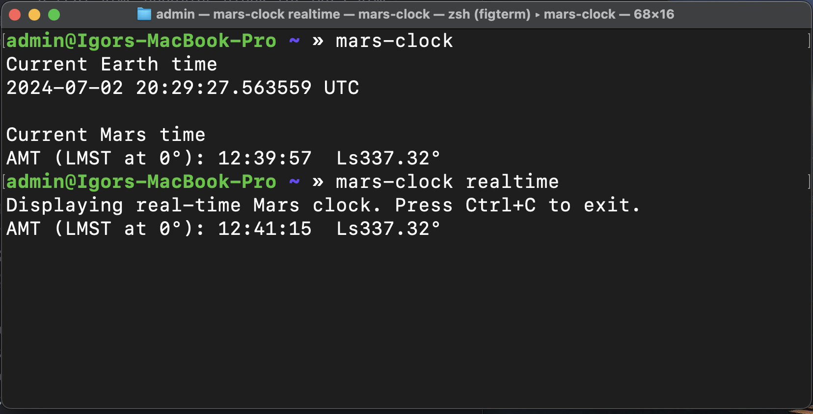

# Mars Clock

A Rust-based utility for calculating and displaying Martian time.  
Demo Image:

## Description

This project provides a tool to convert Earth time to Mars time, including the calculation of Airy Mean Time (AMT) and Solar Longitude (Ls). It features both a one-time display and a real-time updating clock for Mars time.

As we do not have different timezones on Mars yet, the Mars Clock uses a single timezone for the entire planet. The time is displayed in Airy Mean Time (AMT), which is the Mars equivalent of Greenwich Mean Time on Earth, and is based on the Mars Sol (sol = Martian day) length of 88775.244 seconds.

## Features

- Convert Earth time to Mars time
- Calculate Airy Mean Time (AMT)
- Calculate Mars Solar Longitude (Ls)
- Display current Mars time
- Real-time updating Mars clock

## Installation
Download the latest release file from the [releases page](https://github.com/integrityofstellar/mars-clock/releases) and put it somewhere on your computer where you can easily access it.
Then, you can run the Mars Clock from the command line using this file, or you can add it to your PATH, `.bashrc` or `.zshrc` to run it from anywhere.

Current build is done on Intel based MacOS, and works perfectly on it. If you have a different system, you can build the project manually, as I haven't tested it yet.

## Manual Installation

1. Ensure you have Rust installed on your system. If not, you can install it from [https://www.rust-lang.org/](https://www.rust-lang.org/).

2. Clone this repository:
```bash
git clone https://github.com/integrityofstellar/mars-clock.git
cd mars-clock
```

3. Build the project:
```bash
cargo build --release
```

Executable files will be located in the `target/release` directory.

## Usage
Get the current Mars time:
```bash
mars-clock
```

Get the real-time updating Mars clock:
```bash
mars-clock --real-time
```

## How It Works

The Mars Clock uses the following key concepts:

- Julian Date conversion
- Mars sol length (88775.244 seconds)
- Mars epoch (J2000)
- Calculation of Mars Solar Longitude

The time is displayed in Airy Mean Time (AMT), which is the Mars equivalent of Greenwich Mean Time on Earth.

## Contributing

Contributions to improve the Mars Clock are welcome. Please feel free to submit a Pull Request.

## License

This project is open source and available under the [MIT License](LICENSE).

## Acknowledgments

- This project was inspired by the need for accurate Martian timekeeping in space exploration and Mars-related research.
- Special thanks to the Rust community for providing excellent tools and libraries.
- Thanks to NASA and Wikipedia for providing valuable data on Mars timekeeping.
